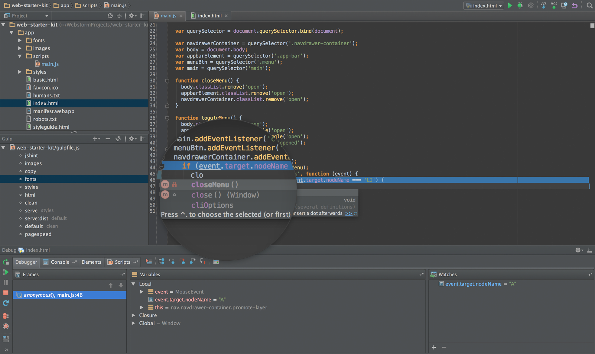

63-21.2 - Atelier d'approfondissement de la programmation
<!-- .element style="font-size:0.7em;margin:4em 0;" -->

# Workshop GIT


<!-- .element style="position:absolute; top:0; left:0;width:40%;" class="nopdf" -->


<!-- .element style="position:absolute; top:0; right:0;width:10%;" class="nopdf" -->

[Boris.Fritscher@he-arc.ch](mailto:Boris.Fritscher@he-arc.ch)
<!-- .element style="position:absolute; bottom:20px; left:0;" class="nopdf" -->

#### Part 0: Requirements

#### *Terminal and Software*


### Command line commands


<!-- .element: class="center" -->

- What commands do you know ?
- What do they do ?
- How to exit a running command line program ?


Command | Description
--- | ---
`d:` | Change the drive
`cd` | Change directory
`ls` | List files
`more` | Display a file's content
`mkdir` | Create a directory
`ni` | Create a new file
`echo "hello" > ` *file* | Write a string to a file
`echo "hello" >> ` *file* | Append a string to a file
`rm` | Remove a file
`mv` | Move a file
`cp` | Copy a file
`start` | Start a program (Windows)
`pwd` | Print working directory
`clear` | Clear the screen


### Chemins absolus et relatifs
- le point (.)  répertoire courant
- deux pointillés (..)  répertoire parent.

<!-- .element: class="w-25 float-left" -->


 D:\Data\Shapefiles\Landuse comme répertoire courant :
 <!-- .element: class="small" -->

```sh
..               (D:\Data\Shapefiles)
..\..            (D:\Data)
..\..\Final      (D:\Data\Final)
.                (D:\Data\Shapefiles\Landuse - the current directory)
.\..\Soils       (D:\Data\Final\Soils)
..\..\.\Final\..\Shapefiles\.\Landuse  (D:\Data\Shapefiles\Landuse)
```
<!-- .element: class="w-70 float-right" -->

https://desktop.arcgis.com/fr/arcmap/10.3/tools/supplement/pathnames-explained-absolute-relative-unc-and-url.htm

<!-- .element: class="credits" -->

[demo_folders.zip](/files/demo_folders.zip)

<!-- .element: class="credits" -->


<!-- .slide: data-background-video="images/windows-terminal.mp4" data-background-video-muted data-background-video-loop -->
### [Windows Terminal](https://www.microsoft.com/fr-ch/p/windows-terminal/9n0dx20hk701?rtc=1&activetab=pivot:overviewtab)


### Exercice: Commande Line

Quels sont les lignes de commandes à effectuer pour obtenir le résultats demandés ?:

[Quiz](https://forms.office.com/Pages/ResponsePage.aspx?id=fX07WxnhBU2QIvd18uSOlnwGT4lx77ZFo6AQM_5Ntr9UMUpPSUdUUk0zRkJCRTlWSlBJMTVNTDBCWi4u)

- Télécharger le fichier [exercice_commande_line.tar.gz](/files/exercice_commande_line.tar.gz)
- Extraire le fichier
- Consulter le ficher Readme.md et suivre les instructions


63-21.2 - Atelier d'approfondissement de la programmation
<!-- .element style="font-size:0.7em;margin:4em 0;" -->

# Workshop GIT


<!-- .element style="position:absolute; top:0; left:0;width:40%;" class="nopdf" -->


<!-- .element style="position:absolute; top:0; right:0;width:10%;" class="nopdf" -->

[Boris.Fritscher@he-arc.ch](mailto:Boris.Fritscher@he-arc.ch)
<!-- .element style="position:absolute; bottom:20px; left:0;" class="nopdf" -->

#### Part 1: Git for Beginners

#### *Introduction to a Version Control System*


# New problems

* Editing code and making backups
* Commenting out code

-> Need for a version control system

<!-- .element: class="bottom right" -->


### Have you ever:

* Made a change to code, realised it was a mistake and wanted to revert back?
* Had to maintain multiple versions of a product?
* Wanted to see the difference between two (or more) versions of your code?
* Wanted to prove that a particular change broke or fixed a piece of code?
* Wanted to review the history of some code?
* Wanted to submit a change to someone else's code?
* Wanted to share your code, or let other people work on your code?
* Wanted to see how much work is being done, and where, when and by whom?
* Wanted to experiment with a new feature without interfering with working code?


https://stackoverflow.com/questions/1408450/why-should-i-use-version-control


# Why use a VCS

* Storing Versions (Properly)
* Reverting Changes
* Branching (experiment, work on different features)
* Collaboration (conflict resolution)
* Understanding What Happened


### Centralized VCS

<!-- .element: class="w-75" -->

<!-- .element: class="center" -->


### Distributed VCS like Git

<!-- .element: class="w-50" -->

<!-- .element: class="center" -->


### Distributed VCS Advantages

* FAST
* OFFLINE (fix/commit multiple operations)
* Geography
* Flexible Workflows
* Easier Merging
* Implicit Backup
* Scale out, not just up

*Disadvantages: no Locks, Disk space*

http://ericsink.com/vcbe/html/dvcs_advantages.html

<!-- .element: class="credits" -->


https://training.github.com/

which cheatsheet?


# Git

Git is a free and open source distributed version control system designed to handle everything from small to very large projects with speed and efficiency.

Download on [git-scm.com](https://git-scm.com/download/win)

* **`git config --global user.name "[firstname lastname]"`** credit when review version history
* **`git config --global user.email "[valid-email]"`** id for commit
* **`git config --global color.ui auto`** command line coloring
* **`git init`** create a new local git repository


### Git lifecycle


http://git-scm.com/book/en/v2/Git-Basics-Recording-Changes-to-the-Repository

<!-- .element: class="credits" -->


### Git basics

* **`git status`** show modified files in working directory, staged for your next commit
* **`git add [file]`** add a file as it looks now to your next commit (stage)
* **`git reset [file]`** unstage a file while retaining the changes in working directory
* **`git commit -m [descriptive message]`** commit your staged content as a new commit snapshot
* **`git log`** show all commits in the current branch’s history
* **`git rm [file]`** delete the file from project and stage the removal for commit
* **`git mv [existing] [new]`** change an existing file path and stage the move
* **`git diff`** diff of what is changed but not staged
* **`git diff --staged`** diff of what is staged but not yet committed


Empty subdirectories cannot be tracked. Create dummy files to work around this problem or .gitkeep


### Exercice


#### [Learn Git](https://www.katacoda.com/courses/git)

- Scenario 1 - Committing Files
- Scenario 2 - Committing Changes


### best pratices

* Explain your commits completely
* Don't comment out code
* Only store the canonical stuff
* Group your commits logically


# Explain your commits completely


https://xkcd.com/1296/

# Do Your Commit Messages Suck?

https://www.youtube.com/watch?v=8YjSty6bfog

<!-- .element: class="center" -->


<iframe width="640" height="480" src="https://www.youtube.com/embed/8YjSty6bfog?rel=0&amp;showinfo=0" frameborder="0" allowfullscreen></iframe>


### Conventional Commits

https://www.conventionalcommits.org/fr/v1.0.0/

* Automatically generating CHANGELOGs.
* Automatically determining a semantic version bump (based on the types of commits landed).
* Communicating the nature of changes to teammates, the public, and other stakeholders.
* Triggering build and publish processes.
* Making it easier for people to contribute to your projects, by allowing them to explore a more structured commit history.

https://github.com/vuejs/vue/blob/dev/.github/COMMIT_CONVENTION.md


# * Don't comment out code

### Recover files

git checkout -- [file]
git commit --ammend
git reset --hard
git revert


# Only store the canonical stuff

### .gitignore

.gitignore tells git which files (or patterns) it should ignore. It's usually used to avoid committing transient files from your working directory that aren't useful to other collaborators, such as compilation products, temporary files IDEs create, etc.

* is used as a wildcard match
\# is used to add comments to a .gitignore file

```
# Ignore Mac system files
.DS_store

# Ignore node_modules folder
node_modules

# Ignore all text files
*.txt

# Ignore files related to API keys
.env
```

http://git-scm.com/docs/gitignore


# Group your commits logically


### Work on different features / bugs


* **`git branch`** list your branches.
* **`git branch [branch-name]`** create a new branch at the current commit
* **`git checkout [branch-name]`** switch to another branch and check it out into your working directory
* **`git checkout -b [branch-name]`** create a new branch and check it out
* **`git merge [branch-name]`** merge the specified branch’s history into the current one


exo branch and merge


# Git flow

* **`git tag [tag-name]`** tag the current commit with a name


https://www.atlassian.com/git/tutorials/comparing-workflows/gitflow-workflow

main
develop
features/
release/
hotfix/


### TEMP commits

* **`git stash`** save modified and staged changes
* **`git stash list`** list stack-order of stashed file changes
* **`git stash pop`** write working from top of stash stack
* **`git stash drop`** discard the changes from top of stash stack
* **`git stash apply`** apply the changes from top of stash stack


63-21.2 - Atelier d'approfondissement de la programmation
<!-- .element style="font-size:0.7em;margin:4em 0;" -->

# Workshop GIT


<!-- .element style="position:absolute; top:0; left:0;width:40%;" class="nopdf" -->


<!-- .element style="position:absolute; top:0; right:0;width:10%;" class="nopdf" -->

[Boris.Fritscher@he-arc.ch](mailto:Boris.Fritscher@he-arc.ch)
<!-- .element style="position:absolute; bottom:20px; left:0;" class="nopdf" -->

#### Part 2: Git for Beginners

#### *Collaborate with others*


* **`git show [SHA]`** show any object in Git in human-readable format


63-21.2 - Atelier d'approfondissement de la programmation
<!-- .element style="font-size:0.7em;margin:4em 0;" -->

# Workshop GIT


<!-- .element style="position:absolute; top:0; left:0;width:40%;" class="nopdf" -->


<!-- .element style="position:absolute; top:0; right:0;width:10%;" class="nopdf" -->

[Boris.Fritscher@he-arc.ch](mailto:Boris.Fritscher@he-arc.ch)
<!-- .element style="position:absolute; bottom:20px; left:0;" class="nopdf" -->

#### Part 3: GitHub Workflow and IDE interface

#### **


Créer compte github


Merge resolve conflicts


* **`git remote add [alias] [url]`**
* **`git fetch [alias]`**
* **`git merge [alias]/[branch]`**
* **`git push [alias] [branch]`**
* **`git pull`**
* **`git clone [uri]`**


# GitHub

[GitHub](https://github.com/) is a web-based Git repository hosting service, adding
its own features:

Wikis, bug tracking, **Markdown** rendering and static page hosting.

Unlike Git, which is strictly a command-line tool, GitHub provides
a web-based **graphical interface**


# Markdown
## From text to HTML


### Markdown Basics

[Markdown](http://daringfireball.net/projects/markdown/syntax) allows you to write using an easy-to-**read**, easy-to-**write** plain **text format**, which then converts to valid HTML.

```markdown
# The largest heading (an <h1> tag)
## The second largest heading (an <h2> tag)

> Blockquotes

Text styling *italic* and **bold**

Links (<a href="url">title</a>)
[title](url)

Images ()

```


### Markdown List and Table

```markdown
Unordered lists
* Item
* Item

- Item
- Item

Ordered lists
1. Item 1
2. Item 2
3. Item 3

some: `c0de`

| Name | Description          |
| ------------- | ----------- |
| Help      | Display the help window.|
| Close     | Closes a window     |
```
<!-- .element: class="float-left w-50" -->

* Item
* Item

<br/>

1. Item 1
2. Item 2

&nbsp;&nbsp;some: `c0de`

| Name | Description          |
| ------------- | ----------- |
| Help      | Display the help window.|
| Close     | Closes a window     |


### Github Web

Browse commits, issues, fork, pull requests, wiki, Readme.md


https://github.com/kuahyeow/git-workshop
https://lab.github.com/githubtraining/reviewing-pull-requests


Assign yourself
Assign the first issue to yourself.
Start
Turn on GitHub Pages
Turn on GitHub Pages in the settings page of the repository.
Close an issue
Cease a conversation by closing an issue.
Create a branch
Create a branch for introducing new changes.
Commit a file
Commit your file to the branch.
Open a pull request
Open a pull request to propose your new file to the codebase.
Respond to a review
Respond to a PR review.
Merge your pull request


Workflow github pull request
https://lab.github.com/githubtraining/introduction-to-github

Fork, Pull requests / branches
Issues,
Stashes
Visual diff, selective stage
markdown

Intelij vs Gitlens vs code?

Stash usage
–list


git add -i
Staging steps change after  already added


### Editors

Exists in all form: from notepad.exe to full IDE: [WebStorm](https://www.jetbrains.com/webstorm/)

<!-- .element: class="w-40 float-left" -->

<!-- .element: class="w-60 float-left" -->

In between: [Notepad++](https://notepad-plus-plus.org/), [Visual Studio Code](https://code.visualstudio.com/),  [Atom](https://atom.io/)
<br/>Online editors: [CodeSandbox](https://codesandbox.io), [StackBlitz](https://stackblitz.com/), [Cloud9](https://c9.io/), [Eclipse Che](http://www.eclipse.org/che/)


git log –oneline –graph –decorate
git blame

ide vscode, desktop, intelij, gitk


### Visual Studio Code Git Support


<!-- .element: class="center" -->

[Documentation](https://code.visualstudio.com/docs/editor/versioncontrol#_git-support)
<!-- .element: class="small" -->


### Visual Studio Code

Can preview markdown in realtime.

<!-- .element: class="smaller" -->


<!-- .element: class="w-60" -->

Warning: markdown on github is a special variant!

<!-- .element: class="red" -->


63-21.2 - Atelier d'approfondissement de la programmation
<!-- .element style="font-size:0.7em;margin:4em 0;" -->

# Workshop GIT


<!-- .element style="position:absolute; top:0; left:0;width:40%;" class="nopdf" -->


<!-- .element style="position:absolute; top:0; right:0;width:10%;" class="nopdf" -->

[Boris.Fritscher@he-arc.ch](mailto:Boris.Fritscher@he-arc.ch)
<!-- .element style="position:absolute; bottom:20px; left:0;" class="nopdf" -->

#### Part 4: Advanced Git commands

#### *Introduction*


git parabol


git hash

eric:hashes_example eric$ git hash-object file1.txt
44bf09d0a2c36585aed1c34ba2e5d958a9379718

eric:hashes_example eric$ git hash-object file2.txt
63ae94dae6067d9683cc3a9cea87f8fb388c0e80

eric:hashes_example eric$ git hash-object file3.txt
782d09e3fbfd8cf1b5c13f3eb9621362f9089ed5

eric:hashes_example eric$ git hash-object file4.txt
a627820d67e455a4f0dfa49c912fbddb88fca483


eric:hashes_example eric$ echo Erik > file5.txt

eric:hashes_example eric$ git hash-object file5.txt
63ae94dae6067d9683cc3a9cea87f8fb388c0e80


More advanced Git commands used in a collaborative project will be presented: conflicting merges, submodules/subtree, Git integration into editor, advanced features of 'git log' and 'git diff', etc.

Advanced
Rebase vs merge


* **`git reflog`**
* **`git bisect`**


* **`git rebase -i`**
* **`git cherry-pick`**

git rebase squash
delete remote tags, branches


delete branch?
move branch?
reset to change branch?
Manipuler l’historique
Rebase interactive
Cherry pick

Reset and move branch name


### Out of Scope
ssh keys
git aliases
git hooks, husky
git submodules
https://ohmygit.org/
https://ohshitgit.com/
